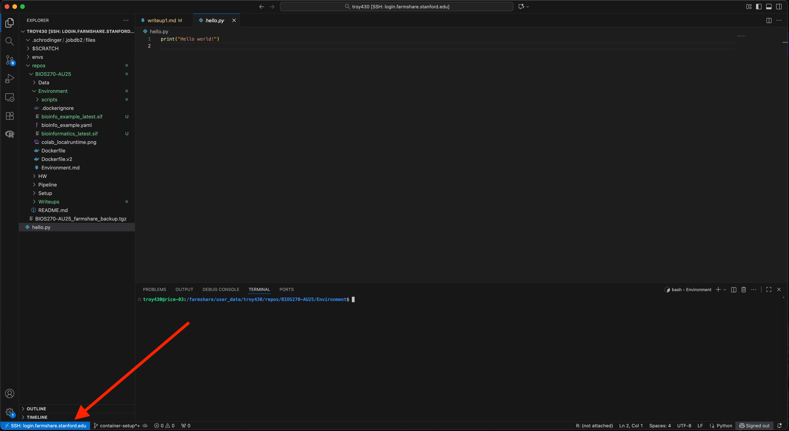

# Write-up 1: Setup, Environments, Containers, and Tools

**Name:** Troy Helenihi  
**Student ID:** troy430  
**Date:** 11/16/2025

---

## Overview

This write-up documents the steps I completed to configure my BIOS 270 computing environment, including Bash profile customization, installing and managing micromamba environments, building and pushing Docker images, and running containers on Farmshare through Apptainer. It also documents the tools I set up for managing my environment, data, and workflow, along with key observations I made throughout the process.

---

## Content
Here contains the screenshots, code snippets, and observations for documentation of work completed from the `Setup.md` and `Environment.md` instructions.

### `Setup.md` documentation
---
**Bash profile configuration:**
```bash
# Added paths and aliases for quicker navigation:
export SCRATCH="/farmshare/user_data/troy430"
export BIOS_REPO="/farmshare/user_data/troy430/repos/BIOS270-AU25"
export WRITEUP="/farmshare/user_data/troy430/repos/BIOS270-AU25/Writeup"
alias cdscr="cd $SCRATCH"
alias cdfork="cd $BIOS_REPO"
alias cdw="cd $WRITEUP"
# Helper function to start agent and add key
ghagent() {
  eval "$(ssh-agent -s)"
  ssh-add ~/.ssh/id_ed25519_farmshare_troy-zen
  ssh -T git@github.com
}
```

Installed **micromamba** (location can be seen in command line):


Installed **Docker Desktop**:


Activated **GCP** free trial on personal account:


Installed **Nextflow**:
```bash
troy430@rice-03:/farmshare/user_data/troy430$ nextflow info
  Version: 25.10.0 build 10289
  Created: 22-10-2025 16:26 UTC 
  System: Linux 6.14.0-27-generic
  Runtime: Groovy 4.0.28 on OpenJDK 64-Bit Server VM 21.0.8+9-Ubuntu-0ubuntu124.04.1
  Encoding: UTF-8 (UTF-8)
```
Opted for **Colab Pro** as free trial accounts on GCP cannot request increased GPU quota:


Created a **Weights & Biases** account to track my ML training metrics and experiment logs.


### SLURM warmup answers to questions in Setup.md

**1. How many slurm jobs will be submitted?**
> Three SLURM jobs will be submitted because the directive `#SBATCH --array=0-2` creates jobs with indices 0, 1, and 2.

**2. What is the purpose of the `if` statement?**
> The purpose of the `if` statement is to evenly split the work across the three SLURM jobs by having each one process only the lines of `data.txt` whose line numbers **match** its array index (based on the modulo result).

**3. What is the expected output in each `*.out` file?**

*Each job’s output file contains the line numbers and values from `data.txt` that correspond to its array index:*

- **Job 0 (`SLURM_ARRAY_TASK_ID=0`)**
```python
0: 12
3: 8
```
- **Job 1 (`SLURM_ARRAY_TASK_ID=1`)**
```python
1: 7
4: 27
```
- **Job 2 (`SLURM_ARRAY_TASK_ID=2`)**
```python
2: 91
5: 30
```
Each file is saved as `logs/warmup_<jobID>_<arrayIndex>.out`.


### `Environment.md` observations & documentation:
---
**Output Plots:**\
 \
 \


**Observations:**

*Compare the new YAML file (bioinfo_example_latest.yaml) with the original one. What changes do you notice?*
> The original `bioinfo_example.yaml` is a human-written template that groups dependencies by type and includes comments. It uses three channels (`conda-forge`, `bioconda`, and `defaults`) and doesn't specify a prefix, so it's portable.\
\
>The `bioinfo_example_latest.yaml` was automatically generated by exporting the current environment. It includes only the `bioconda` and `conda-forge` channels and changes their order, which switches priority. It also added the package `rpy2` package installed in the active environment. The list of dependencies was flattened (no comments or grouping) and was sorted alphabetically. It included a `prefix` pointing to my specific environment path. The original file was an organized blueprint for an environment, while the latest file looked more like a snapshot of the environment that is still readable to the computer but less easily read by humans.

\
*Create an example python file in your `$SCRATCH` that prints "Hello World!" and execute the file with your singularity container. Can you run it? Why do you think this is the case? (Hint: -B flag)*
>The `python` file was not visible within the container because it does not automatically see my `$SCRATCH` directory. You must bind the host `$SCRATCH` directory into the container to make it visible and executable:
```bash
# Executing without binding:
apptainer exec bioinfo_example_latest.sif python $SCRATCH/hello.py
# Output error:
/opt/conda/envs/bioinfo_example/bin/python: cant open file '/farmshare/user_data/troy430/hello.py': [Errno 2] No such file or directory

# Proper execution with Binding:
apptainer exec -B $SCRATCH:$SCRATCH bioinfo_example_latest.sif python $SCRATCH/hello.py
```
\
**Architecture mismatch**

In building the `bioinfo_example` image, a problem I ran into was a mismatch between the machine architectures. My M1 MacBook Pro built an **arm64** container, which the Farmshare machine did not accept as it is **amd64** only. I ran the following command to force my MacBook to build an **amd64** image:

```bash
docker build --platform linux/amd64 -t bioinfo_example .
```
\
**Custom Dockerfile**

While creating `Dockerfile.v2`, I ran into permission errors. This was fixed by specifiying `USER root` and using `chmod` to grant permissions.
```dockerfile
# Start from the image already built
FROM bioinfo_example:latest

USER root

# Install parasail via pip
RUN pip install --no-cache-dir parasail

# Install reseek via curl because of the URL redirects
# Make it executable with permissions
RUN curl -fsSL -o /usr/local/bin/reseek https://github.com/rcedgar/reseek/releases/download/v2.7/reseek-v2.7-linux-x86 \
    && chmod +x /usr/local/bin/reseek
```
\
**Pushed Docker Images:**


**VS Code Remote-SSH**

I opted to use **VS Code Remote-SSH** to work directly on Farmshare. This approach provides the same functionality as the other options but with a smooth UI and better integration with my workflow. The screenshot below shows my VS Code session connected to Farmshare:




---
## Acknowledgement
Collaborator: Eliel Akinbami - helped clarify instructions for customizing my Bash pr:Q:Qofile.