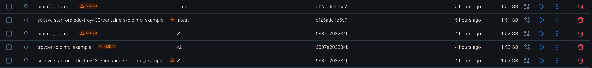

# Write-up 2: Environments, Containers, Docker.

**Name:** Troy Helenihi  
**Student ID:** troy430  
**Date:** 11/16/2025

---

## Overview

This section summarizes my work following Environment.md, including creating and testing a micromamba environment, running the provided example scripts, updating the environment with new packages, and exporting a clean YAML specification. I also built, tagged, and pushed Docker images, generated a reproducible Apptainer (`.sif`) container on Farmshare, and tested container execution using bound directories. I included some simple observations as I went, like differences in the YAML files, architecture issues, and what happened inside the container, just to show what I noticed while working through everything.

---

## Content

### `Environment.md` observations & documentation:
---
**Output Plots:**\


**Observations:**

*Compare the new YAML file (bioinfo_example_latest.yaml) with the original one. What changes do you notice?*
> The original `bioinfo_example.yaml` is a human-written template that groups dependencies by type and includes comments. It uses three channels (`conda-forge`, `bioconda`, and `defaults`) and doesn't specify a prefix, so it's portable.\
\
>The `bioinfo_example_latest.yaml` was automatically generated by exporting the current environment. It includes only the `bioconda` and `conda-forge` channels and changes their order, which switches priority. It also added the package `rpy2` package installed in the active environment. The list of dependencies was flattened (no comments or grouping) and was sorted alphabetically. It included a `prefix` pointing to my specific environment path. The original file was an organized blueprint for an environment, while the latest file looked more like a snapshot of the environment that is still readable to the computer but less easily read by humans.

\
*Create an example python file in your `$SCRATCH` that prints "Hello World!" and execute the file with your singularity container. Can you run it? Why do you think this is the case? (Hint: -B flag)*
>The `python` file was not visible within the container because it does not automatically see my `$SCRATCH` directory. You must bind the host `$SCRATCH` directory into the container to make it visible and executable:
```bash
# Executing without binding:
apptainer exec bioinfo_example_latest.sif python $SCRATCH/hello.py
# Output error:
/opt/conda/envs/bioinfo_example/bin/python: cant open file '/farmshare/user_data/troy430/hello.py': [Errno 2] No such file or directory

# Proper execution with Binding:
apptainer exec -B $SCRATCH:$SCRATCH bioinfo_example_latest.sif python $SCRATCH/hello.py
```
\
**Architecture mismatch**

In building the `bioinfo_example` image, a problem I ran into was a mismatch between the machine architectures. My M1 MacBook Pro built an **arm64** container, which the Farmshare machine did not accept as it is **amd64** only. I ran the following command to force my MacBook to build an **amd64** image:

```bash
docker build --platform linux/amd64 -t bioinfo_example .
```
\
**Custom Dockerfile**

While creating `Dockerfile.v2`, I ran into permission errors. This was fixed by specifiying `USER root` and using `chmod` to grant permissions.
```dockerfile
# Start from the image already built
FROM bioinfo_example:latest

USER root

# Install parasail via pip
RUN pip install --no-cache-dir parasail

# Install reseek via curl because of the URL redirects
# Make it executable with permissions
RUN curl -fsSL -o /usr/local/bin/reseek https://github.com/rcedgar/reseek/releases/download/v2.7/reseek-v2.7-linux-x86 \
    && chmod +x /usr/local/bin/reseek
```
\
**Pushed Docker Images:**



**VS Code Remote-SSH**

I opted to use **VS Code Remote-SSH** to work directly on Farmshare. This approach provides the same functionality as the other options but with a smooth UI and better integration with my workflow. The screenshot below shows my VS Code session connected to Farmshare:

