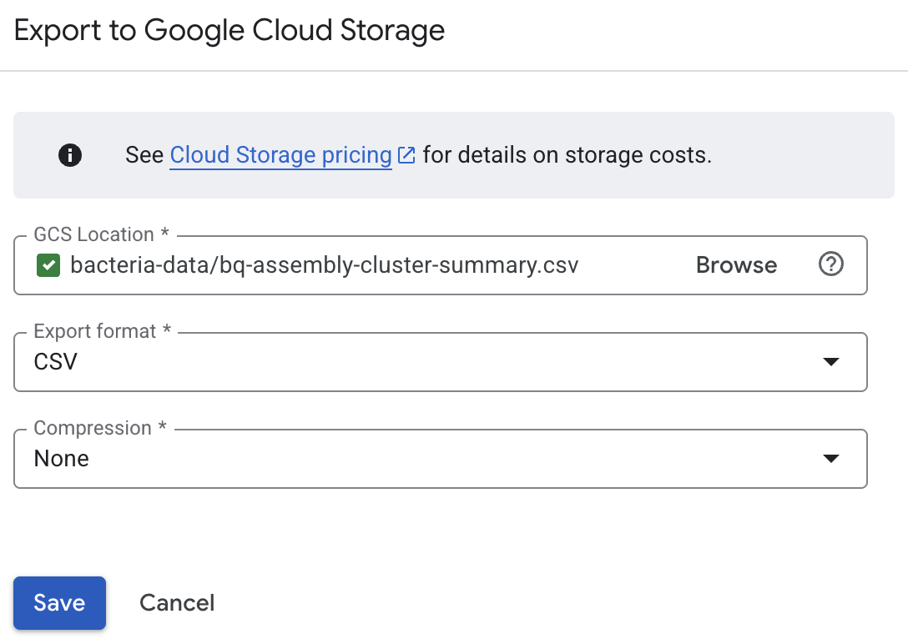

# Write-up 3: Data.md

**Name:** Troy Helenihi  
**Student ID:** troy430  
**Date:** 11/19/2025

---

## Overview
In this assignment, I built a structured workflow to manage bacterial genome data by converting the raw course files into formats that are efficient to query and analyze. I created a local SQLite database (bacteria.db) to store GFF annotations, protein clusters, and metadata, and uploaded these tables to Google BigQuery for scalable querying. Indexing and chunking were used to speed up lookups and to handle data uploads without loading everything into memory.

Finally, I connected the SQL database with the HDF5 protein embedding file. Using SQLite to retrieve all protein_ids for a given record_id, and HDF5 to map those IDs to embedding rows, I wrote a script that outputs an `(N, 164)` embedding matrix for any record. This mirrors real bioinformatics workflows where structured metadata (SQL) and large numeric matrices (HDF5) are combined to support downstream machine learning or comparative analysis.

---

## Content

### 1) Create a Local SQL Database

#### 1.1. Examine `create_bacteria_db.sh`, how many tables will be created in the database?
> **Three** tables are created:
>1. **gff** from `insert_gff_table.py`
>2. **protein_cluster** from `insert_protein_cluster_table.py`
>3. **metadata** from `insert_metadata_table.py`

#### 1.2. In the `insert_gff_table.py` script, explain the logic of using `try` and `except`. Why is this necessary?
> The `try`/`except` block is used to safely write each GFF DataFrame into the SQLite database, which can only handle one writer at a time. When multiple processes try to write to the same `bacteria.db` file simultaneously, SQLite will raise an error saying the database is locked. This means that another process is currently writing, and if we wait a moment, the lock will clear.\
\
>Inside the loop `try` attempts to write the DataFrame into the SQL table. If it succeeds, it will `break` out of the retry loop. If the database is currently locked, it will catch the error, wait one second to give it time to unlock, and then try again. If the error is something else, it will raise it immediately and stop trying because retrying won't fix a real bug.

```python
while try_num < max_retries:
    try_num += 1
    try:
        df.to_sql(gff_table_name, conn, if_exists="append", index=False)
        break
    except (pd.errors.DatabaseError, sqlite3.OperationalError) as e:
        if "database is locked" in str(e):
            logging.info(f"Database is locked, retrying {try_num}/{max_retries}")
            time.sleep(1)
        else:
            raise e
```
#### 1.3. Copying the database to GCS and Drive:
```bash
# Copy to GCS bucket
rclone copy bacteria.db gcs:bacteria-data

# Copy to Drive folder
rclone copy bacteria.db drive:bacteria-data
```

### 2) Querying the Database

#### 2.1. Completing the TODO sections in `query_bacteria_db.py`
```python
   # for unique record_id
   query = "SELECT DISTINCT record_id FROM gff"
   # for list of protein_ids for a given record_id
   query = f"SELECT protein_id FROM gff WHERE record_id = '{record_id}'"
```
>These queries worked becasue the gff table contains `record_id` and `protein_id` columns parsed from the GFF annotations.

#### 2.2. Runtime observations + Indexing
Instructions: *Record the runtime. You may stop the session early if it takes too long and only record the runtime of the first few iterations.
Then, uncomment `db.index_record_ids()` in `query_bacteria_db.py` and note how the runtime changes.*

>***Without indexing:***\
>Took about **2270 seconds** (~39 mins) to process 2600 records (~63% of total records).\
\
>***With indexing:***\
>Total time: **8.677345037460327 seconds**

Why this was the case:

>Without an index, SQLite has to scan the entire gff table every time we ask for a `protein_id` for a specific `record_id`. Since the script repeats this query for every `record_id`, the program ends up doing thousands of full table scans, which is very slow.\
\
>When we add an index with `db.index_record_ids()`, SQLite creates a fast lookup structure that lets it jump directly to the matching rows instead of searching the whole table. This removes the repeated full scans and makes each query much faster, which dramatically reduces the overall runtime.

### 3) Uploading to BigQuery
#### 3.1. Examine the `upload_bigquery.py` script.   Explain the role of `CHUNK_SIZE` and why it is necessary:
```python
df = pd.read_sql_query(
    f"SELECT * FROM {table} LIMIT {CHUNK_SIZE} OFFSET {offset}",
    conn
)
```
>`CHUNK_SIZE` controls how many rows are read from the SQLite database at a time before uploading them to BigQuery. Instead of loading an entire table into memory as one huge DataFrame (which would blow up RAM), it will stream data in smaller, fixed-size chunks. This keeps memory use predictable and makes the upload more stable and scalable as the dataset grows.


#### 3.2. BigQuery query involving two tables

This query joins the **gff** and **protein_cluster** tables using `protein_id` to connect each genomic feature with its protein cluster annotation. The results are grouped by `assembly_id`, which lets us summarize what's happening within each assembly.
For every assembly, the query reports:
- how many unique proteins appear
- how many different protein clusters those proteins belong to
- the average size of those clusters

This lets us see, for each assembly, how many proteins it encodes and how those proteins are distributed across clusters.

```sql
SELECT
  g.assembly_id,
  COUNT(DISTINCT g.protein_id) AS num_proteins,
  COUNT(DISTINCT pc.cluster_id) AS num_clusters,
  AVG(pc.cluster_size) AS avg_cluster_size
FROM
  `bios270-477923.bacteria.gff` AS g
JOIN
  `bios270-477923.bacteria.protein_cluster` AS pc
ON
  g.protein_id = pc.protein_id
GROUP BY
  g.assembly_id
ORDER BY
  num_clusters DESC
LIMIT 100;
```
#### 3.3. Exporting Results to GCS
Exported BigQuery results to my **bacteria-data** bucket on Google Cloud Storage as a `.csv` file.


### 4) HDF5 Data Explanation
**Explain why the following chunk configuration makes sense - what kind of data access pattern is expected, and why does this align with biological use cases?**

```python
chunk_size = 1000
chunks = (chunk_size, n_features)
```
>Protein embeddings are stored as a large matrix, where each row is one protein and each column is one of the 164 embedding features. In most biological analyses, data is accessed in groups (e.g. all proteins from a record or all proteins from an assembly) rather than one protein at a time.
>
>Setting the chunk shape to `(1000, n_features)` means the file stores the data in blocks of 1,000 proteins. This matches how the data is used in large consecutive slices that are read at once. Chunking the dataset in this way makes those group reads faster and reduces overhead, because HDF5 can load entire blocks efficiently instead of doing lots of small random accesses.

### 5) SQL + HDF5 Practice Script
Below is the link to my full script used to combine SQLite and HDF5 to produce an (N, 164) embedding matrix for a given `record_id` and specified `metric`.
##### link python script here
[extract_record_embeddings python script](URL to python script)

#### 5.1. Explanation of the script flow
1) Use SQLite database (`bacteria.db`) to look up all protein IDs associated with the given `record_id`.

2) Open the HDF5 file (`protein_embeddings.h5`) containing:
    - `protein_ids` (string list)
    - `mean` or `mean_mid` datasets (164-dim embeddings)
3) Build a dictionary mapping
protein_id -> row index in embedding matrix

4) Convert the SQL protein IDs into embedding indices

5) Use index to efficiently extract a matrix of shape (N, 164)

6) Save the result as a .npy file

#### 5.2. Example output (record_id = AP019514.1)
```bash
# Command with args
python3 extract_record_embeddings.py \
> --database_path bacteria.db \
> --record_id AP019514.1 \
> --metric mean_embeddings \
> --output_path embeddings_AP019514.1.npy
# Output
Saved embeddings to embeddings_AP019514.1.npy
Matrix shape: (6703, 164)
```

