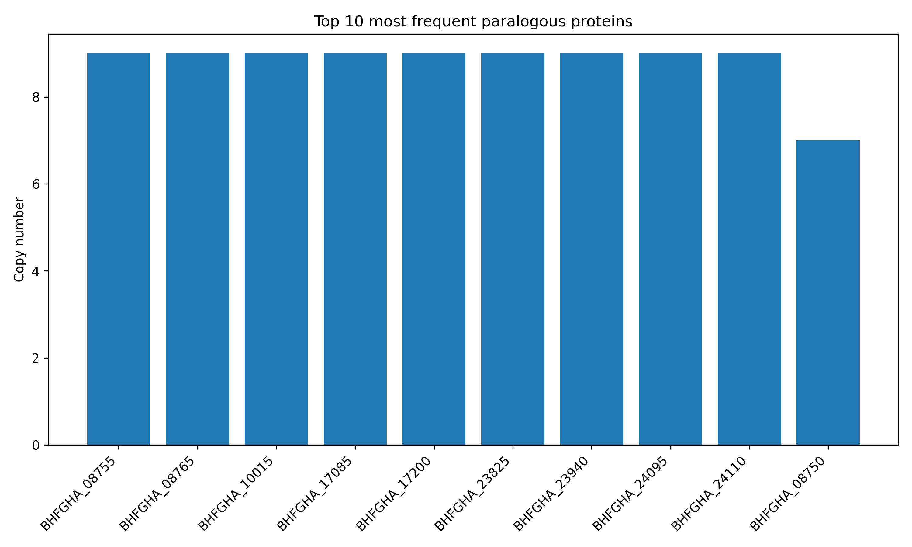
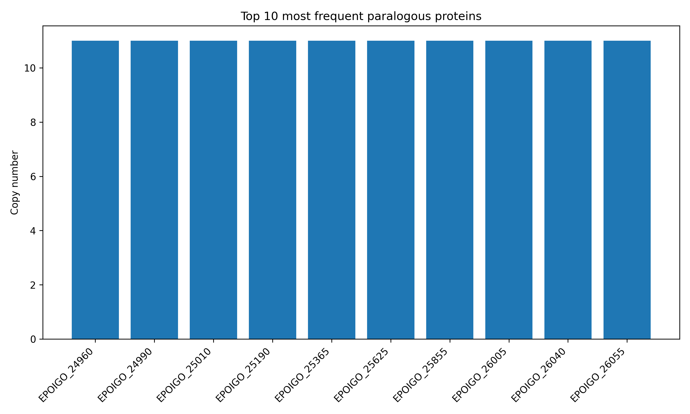

# Write-up 5: Project 1

**Name:** Troy Helenihi  
**Student ID:** troy430  
**Date:** 12/11/2025

---
---
## Overview

The goal of this project was to build an end-to-end genomics pipeline to identify paralogous protein-coding genes in two bacterial genomes using long-read Nanopore sequencing data. The workflow consisted of four main steps: de novo genome assembly with Flye, genome annotation with Bakta, protein clustering with MMseqs2, and a custom Python script to summarize and visualize duplicated gene families. By applying this pipeline to E. coli and K. pneumoniae, I generated annotated assemblies and identified the most expanded paralog groups in each genome.

## Methods

### 0. Project Structure and Workflow Organization
All analyses were organized in a structured project directory to ensure reproducibility and separation of outputs at each stage of the pipeline.

For each sample (*E. Coli* and *K. pneumoniae*), a parallel directory hierarchy was created:
```bash
Project1/
 ├── ecoli/
 │    ├── flye_out/        # Flye genome assembly
 │    ├── bakta_out/       # Bakta genome annotation
 │    ├── mmseqs_out/      # MMseqs2 clustering results
 │    └── results/         # Final paralog summaries + plots
 │
 └── kpneu/
      ├── flye_out/
      ├── bakta_out/
      ├── mmseqs_out/
      └── results/

logs/                     # Slurm output logs for all steps
run_flye.sbatch           # Assembly script
run_bakta.sbatch          # Annotation script
run_mmseqs.sbatch         # Clustering script
summarize_paralogs.py     # Custom summarization + plotting script
```
A single Slurm script was written for each computational step (`run_flye.sbatch`, `run_bakta.sbatch`, `run_mmseqs.sbatch`).
Each script accepts a **sample name** (e.g. `ecoli`, `kpneu`) and automatically routes intermediate files into the correct folder based on:

```bash
PROJECT_ROOT/Project1/$SAMPLE_NAME/<step>_out/
```
This design allowed the entire pipeline to be run identically for different genomes while keeping all outputs isolated and easy to inspect.

**Pipeline scripts (clickable)** \
[run_flye.sbatch](https://github.com/troy-zen/BIOS270-AU25/blob/main/Project1/run_flye.sbatch) - Assembly script \
[run_bakta.sbatch](https://github.com/troy-zen/BIOS270-AU25/blob/main/Project1/run_bakta.sbatch) - Annotation script \
[run_mmseqs.sbatch](https://github.com/troy-zen/BIOS270-AU25/blob/main/Project1/run_mmseqs.sbatch) - Clustering script \
[summarize_paralogs.py](https://github.com/troy-zen/BIOS270-AU25/blob/main/Project1/summarize_paralogs.py) - Paralog summarization and plotting

### 1. Genome Assembly

Raw nanopore FASTQ files were assembled *de novo* using Flye inside the course bioinformatics container (`bioinformatics_latest.sif`).
Flye was run with 32 threads and default long-read parameters
```bash
flye --nano-raw <FASTQ> --out-dir <sample>/flye_out --threads 32
```
The main output was `assembly.fasta`, representing the draft genome for each sample.

### 2. Genome Annotation

Genome assemblies were annotated using Bakta with the provided Bakta database:
```bash
bakta --db bakta_db --output <sample>/bakta_out assembly.fasta --threads 16
```
The key output file for downstream analysis was assembly.faa, containing all predicted protein-coding sequences with descriptive headers.

### 3. Protein Clustering and Paralog Identification

To identify paralogous genes, proteins were clustered using MMseqs2:
```css
mmseqs easy-cluster assembly.faa <sample>_prot90 tmp --min-seq-id 0.9 -c 0.8 --cov-mode 1 -s 7 --threads 32
```
MMseqs2 produces a `*_cluster.tsv` file mapping each protein to a cluster representative. Clusters containing more than one protein were considered paralogous.

### 4. Paralog Summary and Visualization

A custom Python script parsed:
- Bakta protein FASTA headers
- MMSeqs2 cluster assignments
It output a TSV file:
```nginx
protein_id   protein_name   copy_number
```
and a **bar plot** of the **top 10** most frequent paralogs for each genome.

## Results
### Genome Assembly

**Flye** produced high-quality assemblies for both genomes.

- **E. coli**: 5.07 Mb total length across 12 contigs (N50 = 4.73 Mb)

- **K. pneumoniae**: 5.47 Mb total length across 5 contigs (N50 = 5.24 Mb)

These assembly sizes are consistent with expected genome sizes for these species.

---
### Genome Annotation

**Bakta** predicted:

- **4804 proteins** in *E. coli*

- **5029 proteins** in *K. pneumoniae*

These values are within the expected ranges for Enterobacteriaceae genomes.

---
### Protein Clustering and Paralog Identification

**MMseqs2** clustering generated:

- **4804 cluster assignments across 4711 clusters** for *E. coli*

- **5209 cluster assignments across 4981 clusters** for *K. pneumoniae*

The small difference between the # of clusters and the total # of cluster assignments indicates that most genes are single-copy, as expected for bacteria.

The most expanded paralogous families in both genomes were **insertion sequence (IS) transposases**, especially IS1, IS3, and IS6/IS629 families.

In *E. coli*, the IS1 family appeared in up to *9 copies*, with IS3 and IS6 families also present in 5–7 copies.

These results are consistent with known bacterial genome dynamics, where mobile elements commonly occur in multiple copies.

### Figures

#### Figure 1. Top 10 most frequent paralogous proteins in E. coli


#### Figure 2. Top 10 most frequent paralogous proteins in K. pneumoniae



## Discussion

Across both genomes, most genes appeared only once, which is typical for bacteria. The main paralogs we found were different types of insertion sequence (IS) transposases. These are mobile DNA elements that naturally occur in multiple copies and often move around the genome. Seeing IS1, IS3, and IS6/IS629 families as the most duplicated genes is expected for both E. coli and K. pneumoniae. This matches what is known about their genome structure and shows that the pipeline correctly identified real biological patterns.

---
---